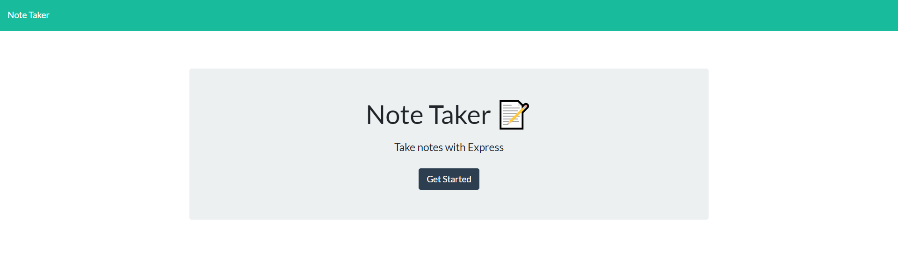

<h1 align="center"> Express.JS: 
<br>Note Taker 👋</h1>
<p align="center">
  <a href="#">
  
  <a href="#">
  
  <a href="#">
  
  
  <a href="#">
  
  <br>
  <a href="https://www.buymeacoffee.com/adampham123">
  
  <a href="#">
  
  <a href="#">
  
  <a href="https://github.com/ThiHoangPham/note-taker/blob/main/LICENSE">
  
  </a>
  <a href="#">
  
  <a href="#">
  
  </a>
  <a href="#">
  
  </a>
  <a href="#">
  
  </a>
  <a href="https://twitter.com/AdamThaiHoang1">
  
  </a>
</p>
<hr>

## Description:
An application called Note Taker that can be used to write and save notes. This application will use an Express.js back end and will save and retrieve note data from a JSON file.

## User Story:
```
AS A small business owner
I WANT to be able to write and save notes
SO THAT I can organize my thoughts and keep track of tasks I need to complete
```
## Acceptance Criteria
```
GIVEN a note-taking application
WHEN I open the Note Taker
THEN I am presented with a landing page with a link to a notes page
WHEN I click on the link to the notes page
THEN I am presented with a page with existing notes listed in the left-hand column, plus empty fields to enter a new note title and the note’s text in the right-hand column
WHEN I enter a new note title and the note’s text
THEN a Save icon appears in the navigation at the top of the page
WHEN I click on the Save icon
THEN the new note I have entered is saved and appears in the left-hand column with the other existing notes
WHEN I click on an existing note in the list in the left-hand column
THEN that note appears in the right-hand column
WHEN I click on the Write icon in the navigation at the top of the page
THEN I am presented with empty fields to enter a new note title and the note’s text in the right-hand column
```

## Table of Contents:
- [Description](#description)
- [User Story](#user-story)
- [Acceptance Criteria](#acceptance-criteria)
- [Live Demo Heroku](#live-demo-heroku)
- [Installation](#installation)
- [Contributor](#contributor)
- [Contribution](#contribution)
- [Contact Information](#contact-information)

## Live Demo Heroku: 
<a href="https://note-taker-express-js-adam.herokuapp.com/">
  
  </a>

## Installation:
`npm install`, `node server.js`

## Contributor:
<a href="https://github.com/ThiHoangPham">
  
  </a>

## Contribution:
Please email to me if you have any contribution, I am more than happy with that. Thank you!
    